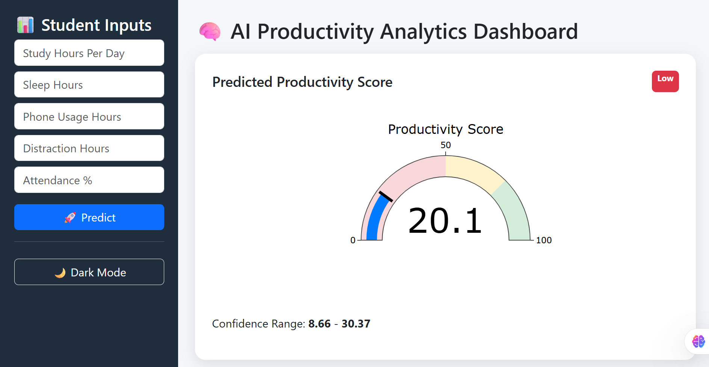
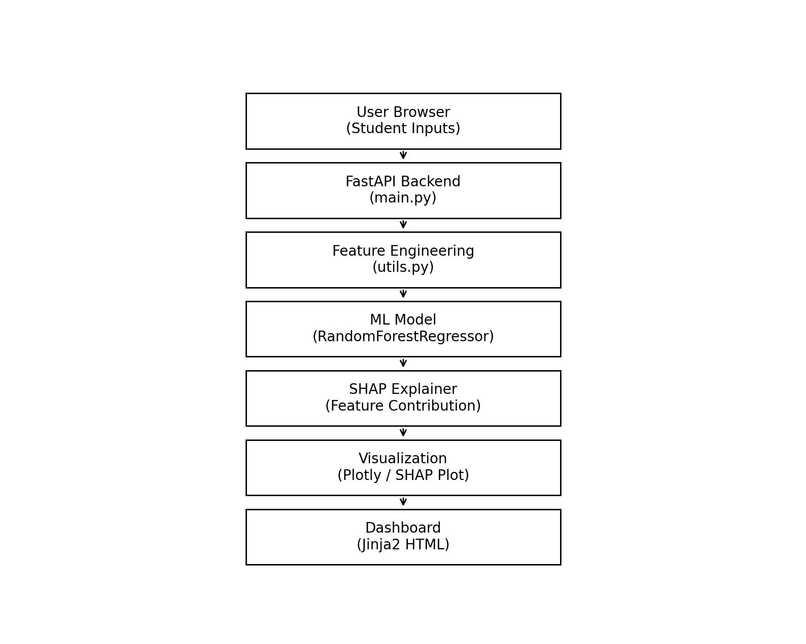

# 🧠 Student Productivity AI Dashboard

An End-to-End Machine Learning Web Application that predicts student productivity based on study habits and lifestyle factors.

The system also provides Explainable AI insights (SHAP) to show why the model made a prediction and suggests ways to improve productivity.

***

# 🚀 Live Features

## 📊 Productivity Prediction

Predicts a Productivity Score (0–100) using a trained ML model.

## 🧠 Explainable AI

Uses SHAP values to explain model decisions.

# 📈 Interactive Dashboard

Displays:
1. Productivity Gauge
2. Confidence Interval
3. Feature Impact Visualization
4. AI Insights

## 💡 Smart Suggestions

1. Automatically suggests improvements like:
2. Reduce phone usage
3. Improve sleep schedule
4. Reduce distractions

***

## 🖥 Dashboard Preview

Productivity Prediction Dashboard

***

# Architecture diagram

***

# 🧠 Machine Learning Model

### Algorithm Used:

#### Random Forest Regressor

### Target Variable:

#### productivity_score

### Evaluation Metrics:
| Metric   | Score |
| -------- | ----- |
| R² Score | 0.78  |
| MAE      | 6.18  |
| RMSE     | 7.42  |

***

## 📊 Explainable AI

The project uses SHAP (SHapley Additive Explanations) to interpret model predictions.
The dashboard shows:

#### ✔ Positive feature impacts
#### ✔ Negative feature impacts
#### ✔ Feature importance chart

This improves model transparency and trust.

***

## 📈 Example Output

Predicted Productivity Score: 82

Positive Impacts:
✔ Study Hours
✔ Good Sleep Pattern

Negative Impacts:
⚠ High Phone Usage
⚠ High Distraction Time

Suggestions:
• Reduce phone usage
• Improve focus during study

***

# 👨‍💻 Author

#### Kumar Prabhat
> AI & Machine Learning Student | Passionate about building AI-powered real-world system

***

## ⭐ Support

If you found this project helpful:

⭐ Star the repository
🍴 Fork the project
🧠 Share feedback

***

#### Dataset link:- https://www.kaggle.com/datasets/sehaj1104/student-productivity-and-digital-distraction-dataset

## You can connect me on:

Linkedin:- https://www.linkedin.com/in/kumar-prabhat-067276336/

